# Architecture — Tuttle (Senior Travel Planner)

---

## 1. System Context

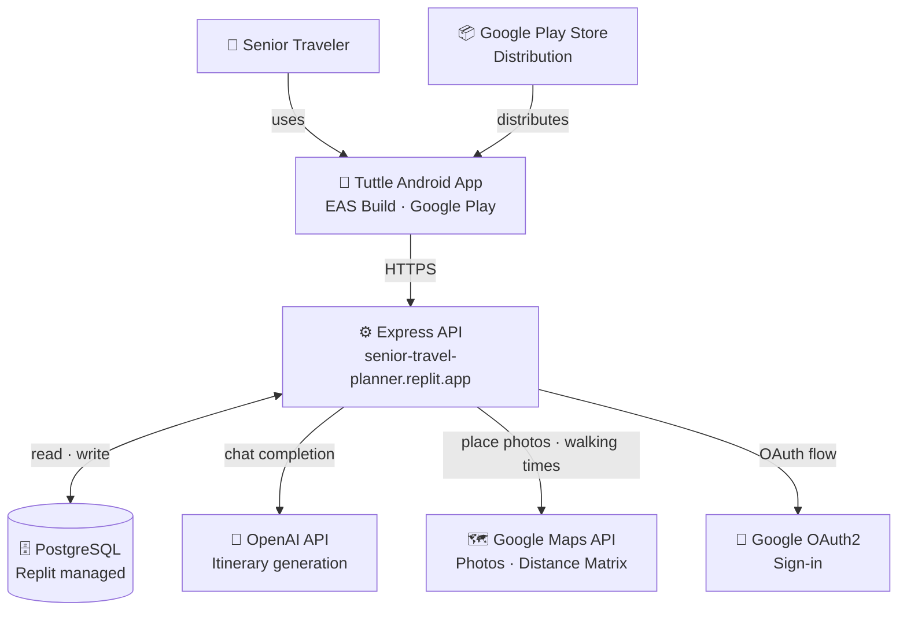

---

## 2. Mobile App Architecture

### 2.1 Screen Navigation (Expo Router)

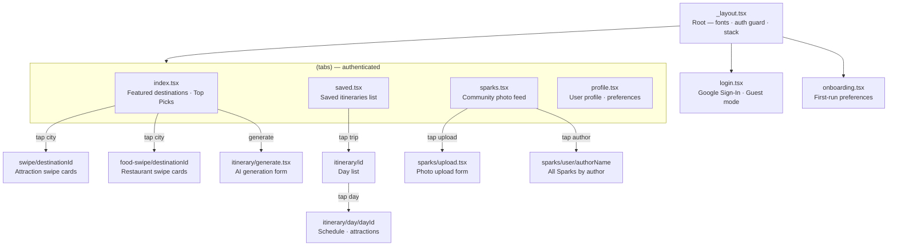

### 2.2 State Management

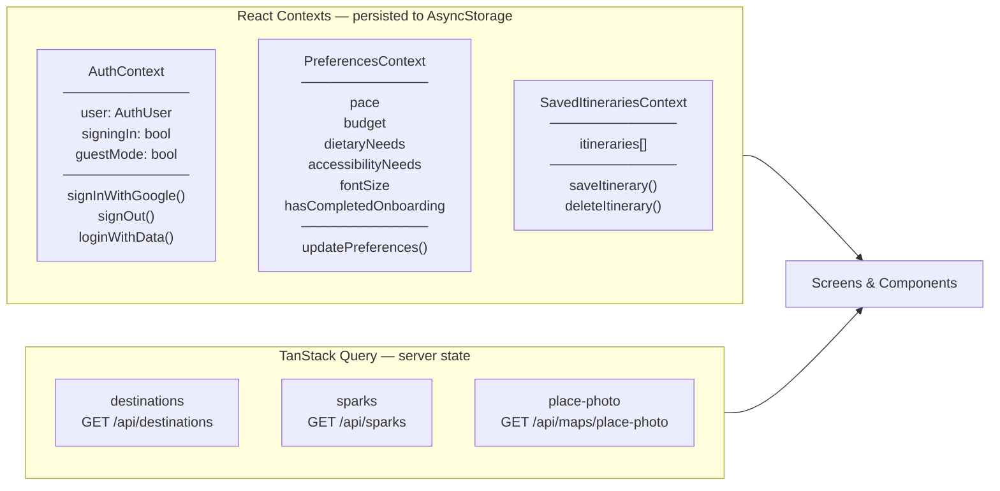

---

## 3. API Server Architecture

### 3.1 Route Map

```
Express App
│
├── GET  /health
├── GET  /privacy                        Static HTML
├── GET  /delete-account                 Static HTML
│
└── /api
    ├── GET  /destinations
    ├── GET  /destinations/search
    ├── GET  /destinations/:id/attractions
    ├── GET  /destinations/:id/restaurants
    │
    ├── GET  /maps/place-photo           Google Places proxy (in-memory cache)
    │
    ├── GET    /itineraries
    ├── POST   /itineraries/generate     OpenAI + Distance Matrix
    ├── GET    /itineraries/:id
    └── DELETE /itineraries/:id
    │
    ├── GET  /sparks
    ├── POST /sparks
    ├── POST /sparks/:id/like
    └── GET  /sparks/user/:author
    │
    ├── GET  /auth/google-initiate
    ├── GET  /auth/google-callback
    ├── POST /auth/store-session
    └── GET  /auth/session/:id
```

### 3.2 Middleware Stack

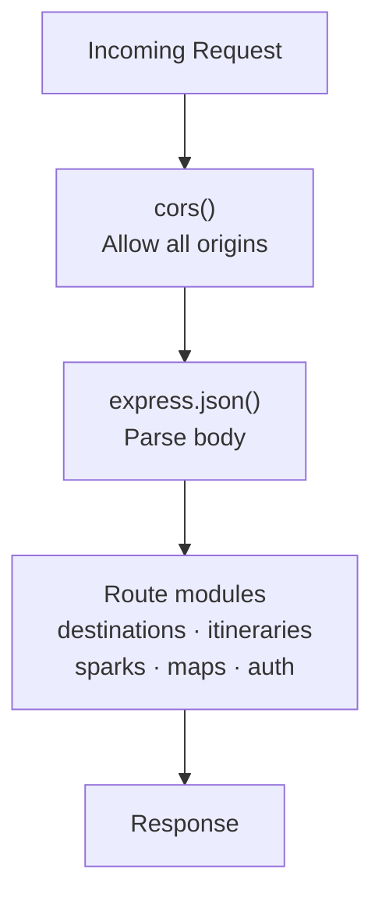

---

## 4. Database Architecture

### 4.1 Entity Relationship

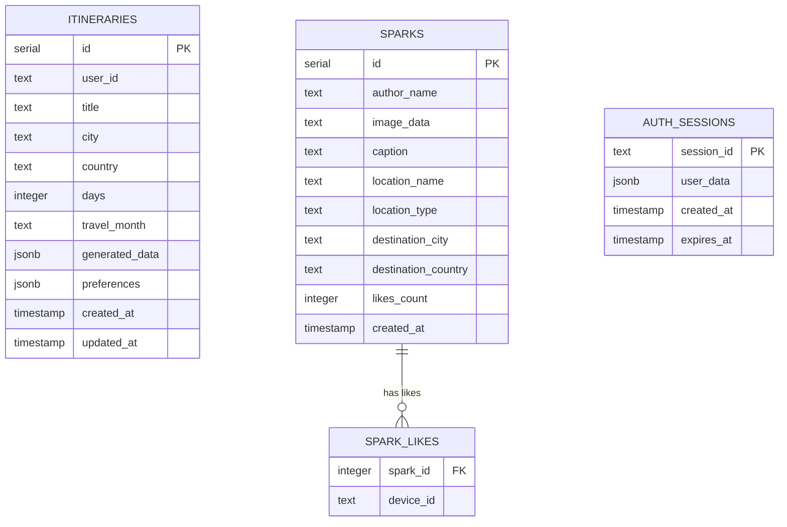

### 4.2 ORM Access Pattern

| Table | Access | Reason |
|---|---|---|
| `itineraries` | Drizzle ORM (typed queries) | Complex schema, type safety needed |
| `sparks` + `spark_likes` | Raw `pg` pool | JOIN + conditional UPDATE, simpler as raw SQL |
| `auth_sessions` | Raw `pg` pool | Simple key-value with TTL, no schema benefit |

---

## 5. Authentication Flow

### 5.1 Native Android (Custom Scheme Redirect)

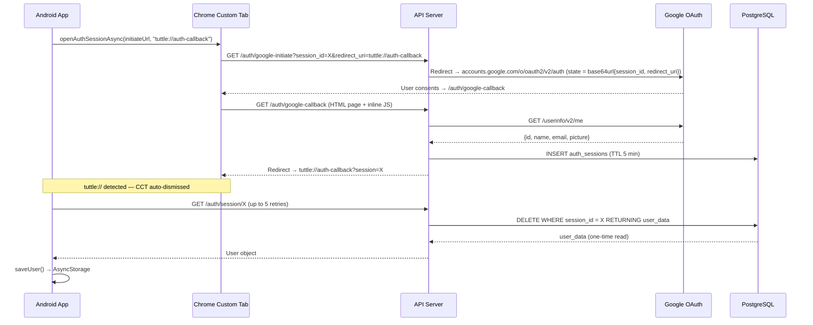

### 5.2 Web (Polling)

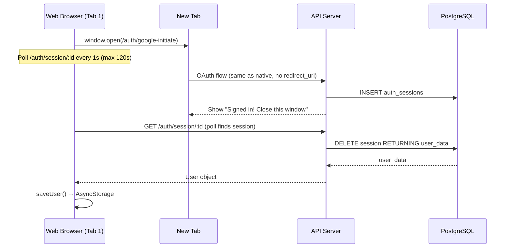

### 5.3 Session Security Properties

| Property | Implementation |
|---|---|
| Expiry | 5-minute TTL, cleaned up every 60 seconds |
| One-time use | `DELETE ... RETURNING` — consumed on first read |
| CSRF protection | Random `session_id` in OAuth state param |
| Key exposure | No client secret on mobile; Google client ID is safe to expose |

---

## 6. AI Itinerary Generation

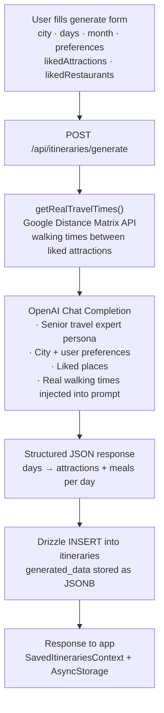

---

## 7. Sparks Community Feed

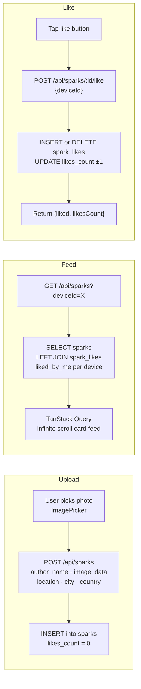

---

## 8. Infrastructure & Deployment

### 8.1 Hosting Overview

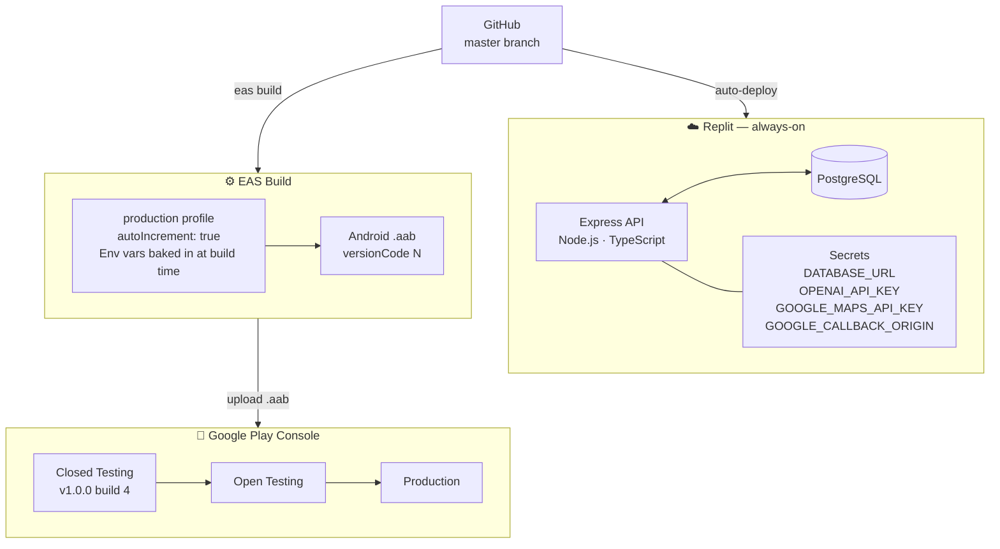

### 8.2 Build & Release Pipeline

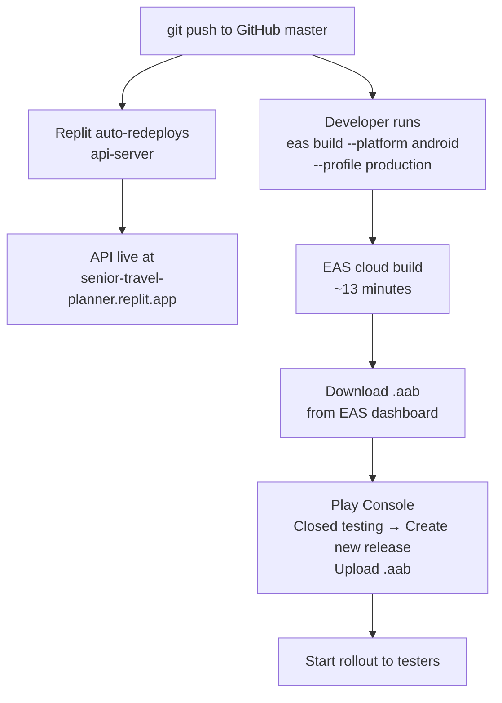

### 8.3 Monorepo Structure

```
pnpm-workspace.yaml
│
├── artifacts/mobile          @tuttle/mobile
├── artifacts/api-server      @tuttle/api-server
├── lib/db                    @workspace/db
├── lib/integrations-*        @workspace/integrations-openai-*
├── lib/api-spec              @workspace/api-spec
├── lib/api-client-react      @workspace/api-client-react
└── lib/api-zod               @workspace/api-zod
```

---

## 9. Key Technical Decisions

| Decision | Choice | Rationale |
|---|---|---|
| Auth method | Server-side OAuth + session DB | No client secret on device; works across Android + web; no native SDK setup |
| OAuth browser dismissal | `tuttle://` custom scheme + `openAuthSessionAsync` | Auto-dismisses CCT; no "close this window" UX needed |
| Destination data | In-memory TypeScript constant | Fast (no DB read), version-controlled; acceptable for v1 with ≤30 cities |
| ORM | Drizzle (structured) + raw `pg` (ad-hoc) | Type safety where schema is complex; brevity for simple queries |
| State management | React Context + AsyncStorage | Sufficient for v1; avoids Redux boilerplate; contexts map 1:1 to domain |
| Image storage | base64 in PostgreSQL text column | Simplest path for v1; no object storage to manage |
| Delete button | Sibling `TouchableOpacity` elements | Avoids nested-touchable gesture bug in React Native New Architecture |
| Build env vars | `EXPO_PUBLIC_*` baked in at EAS build | Only method available for native builds; not runtime-configurable |

---

## 10. Known Limitations & Future Roadmap

```mermaid
flowchart LR
    subgraph Now["v1 — Current"]
        N1["Android only"]
        N2["15 hardcoded destinations"]
        N3["Google Sign-In only"]
        N4["base64 image storage"]
        N5["Open API endpoints"]
        N6["No push notifications"]
        N7["No offline support"]
    end

    subgraph Next["v2 — Near Term"]
        V1["iOS build\nApple Sign-In"]
        V2["CMS for destinations\nadmin UI"]
        V3["Cloud image storage\nS3 / GCS"]
        V4["API auth middleware\nJWT on user routes"]
        V5["Push notifications\nEAS Notifications"]
    end

    subgraph Future["v3 — Growth"]
        F1["Booking integrations\nGetYourGuide · Viator affiliate"]
        F2["Full-text search\nPostgreSQL tsvector"]
        F3["Content moderation\nGoogle Vision safe-search"]
        F4["Analytics\nPostHog · Amplitude"]
        F5["Offline mode\nReact Query persistQueryClient"]
    end

    Now --> Next --> Future
```
